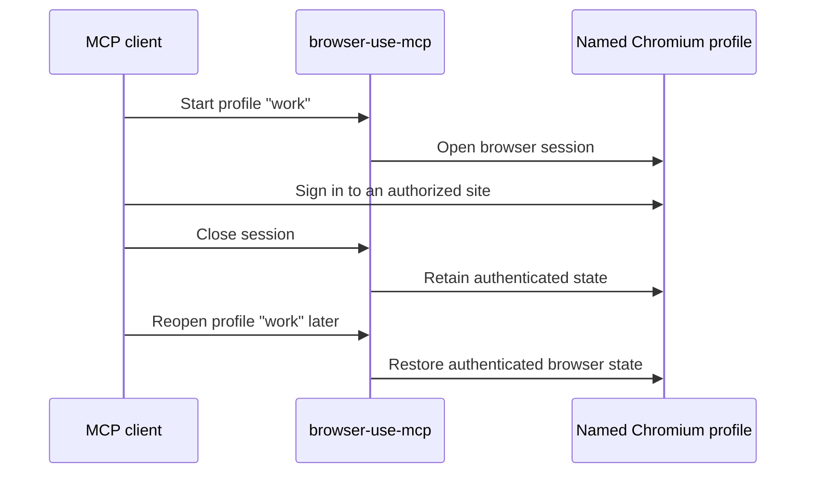

# browser-use-mcp

[](https://github.com/s-block/browser-use-mcp/actions/workflows/ci.yml)
[](https://github.com/s-block/browser-use-mcp/blob/main/LICENSE)
[](https://www.python.org/)

**Give AI agents a persistent, secure browser over MCP.**

`browser-use-mcp` lets MCP clients navigate websites, interact with pages,
extract data, and reopen named browser profiles with their authenticated website
state intact. It combines semantic Stagehand actions with deterministic browser
controls, while isolating tenants and encrypting persisted profile metadata.

It is designed for running browser agents as a service: browser operations are
bounded, named profiles have one-writer leases, browser requests are checked
against a network policy, and session lifecycle events are audited without page
content or secrets.



## Why browser-use-mcp?

- **Persistent authenticated profiles.** Reuse a named Steel profile in later
  browser sessions instead of signing in for every agent run.
- **Semantic and deterministic control.** Use Stagehand when the task depends on
  page meaning; use constrained selector controls for known clicks, fields,
  keys, text, titles, and URLs without a model call.
- **Service-ready isolation.** Tenant-scoped profiles and browser sessions,
  cross-process profile leases, authenticated encrypted metadata, optional
  bearer authentication, bounded concurrency, and secret-safe audit events.
- **Remote Chromium.** The MCP service stays small while Steel owns the browser,
  browser profile data, and Chromium runtime.

## Quick start

You need Python 3.12 through 3.14, [uv](https://docs.astral.sh/uv/), a Steel
deployment, and a Steel API key when using Steel Cloud. Semantic actions also
need an OpenAI-compatible Chat Completions endpoint; deterministic controls do
not call a model.

Clone the repository and install its locked dependencies:

```bash
git clone https://github.com/s-block/browser-use-mcp.git
cd browser-use-mcp
uv sync --dev --frozen
```

Configure a trusted local instance:

```bash
export BROWSER_USE_MCP_STORAGE_MASTER_KEY="$(uv run python - <<'PY'
import base64
import secrets
print(base64.b64encode(secrets.token_bytes(32)).decode())
PY
)"
export STEEL_API_KEY="..."
export BROWSER_USE_MCP_LLM_BASE_URL="https://api.openai.com/v1"
export BROWSER_USE_MCP_LLM_API_KEY="..."
export BROWSER_USE_MCP_LLM_MODEL="your-model"
export BROWSER_USE_MCP_ALLOW_PRIVATE_NETWORK=true
uv run browser-use-mcp
```

The Streamable HTTP endpoint is `http://127.0.0.1:8000/mcp`, and the
unauthenticated health endpoint is `/healthz`. The private-network setting is an
explicit acknowledgement for a trusted, loopback-only development environment;
shared deployments need the egress boundary described in
[Security boundary](#security-boundary).

For an MCP client that launches servers over standard input and output:

```bash
export BROWSER_USE_MCP_TRANSPORT=stdio
uv run browser-use-mcp
```

Stdio mode does not open an HTTP port. It uses the local unauthenticated
principal because the launching MCP client or gateway owns the connection and
its authorization boundary.

## Example agent prompts

- “Open Hacker News and summarize the top five stories.”
- “Start a named profile called `work`, sign in to my authorized test account,
  and close the browser session when you are done.”
- “Reopen the `work` profile and check whether I have any GitHub notifications.”
- “Find the pricing page and extract the enterprise features.”
- “Open this page, find the sign-up button, and tell me what information the
  form requires.”

Use only websites and accounts you own or are authorized to automate. For
credential fields, deterministic controls avoid sending the field operation to
the configured model provider; review the model disclosure details before using
semantic tools on authenticated pages.

## Choose the right control mode

| Mode | Tools | Best for | Model call |
| --- | --- | --- | --- |
| Semantic | `browser_act`, `browser_observe`, `browser_extract` | Tasks that depend on page meaning or changing layouts | Yes |
| Deterministic | `browser_control` | Known selectors, fields, keys, and page properties | No |

Both modes use the same bounded browser session and network policy.

## How it works

```text
MCP client → browser-use-mcp → Stagehand → Steel → Chromium
```

This is an independent MCP server built on the current async
[MCP Python SDK](https://github.com/modelcontextprotocol/python-sdk),
[Stagehand](https://github.com/browserbase/stagehand), and
[Steel](https://docs.steel.dev/overview/intro-to-steel). Stagehand attaches to
the Steel-hosted Chromium session over CDP. The MCP-facing models remain smaller
than the upstream browser and page representations.

## MCP tools

| Tool | Purpose |
| --- | --- |
| `browser_session_start` | Start a temporary session or lease a named profile |
| `browser_session_close` | Release the browser and any profile lease |
| `browser_navigate` | Navigate the active page to an authorized HTTP(S) URL |
| `browser_act` | Perform one semantic Stagehand action |
| `browser_observe` | Find relevant actions on the active page |
| `browser_extract` | Extract a bounded text result from the active page |
| `browser_control` | Click, fill, type, press a key, or read text/title/URL |
| `browser_profiles_list` | List named profiles in the current client namespace |

The server does not expose provider session identifiers, profile filesystem
paths, encryption keys, cookies, or LLM credentials through MCP. Returned
browser URLs omit query strings, fragments, and embedded credentials.

## Persistent profiles

Start a named session to preserve authenticated website state:

```json
{
  "profile_name": "work"
}
```

Always close the returned session. The profile remains leased and unavailable
to another writer until `browser_session_close` completes. Closing also waits
for Steel to finish uploading the profile before the profile is reused. If
closing reports a provider error, retry the same close call; the server keeps
the session capacity and profile lease until cleanup succeeds or it shuts down.

## Security boundary

Tool arguments, page content, redirects, subresources, and model output are
untrusted. Browser HTTP(S) requests are paused through the Chrome DevTools
Protocol before HTTP request bytes are transmitted and checked against the
configured network policy. This includes navigation redirects, requests
initiated by page scripts, frames, workers, clicks, and semantic actions. Chrome
can establish a TCP connection before the Fetch pause, so this layer does not
prevent port reachability or replace network egress enforcement.

The MCP process resolves hostnames locally, while Chromium resolves them from
the Steel network. That application check cannot by itself prevent split-horizon
DNS or DNS rebinding. When `BROWSER_USE_MCP_ALLOW_PRIVATE_NETWORK=false`, startup
therefore also requires
`BROWSER_USE_MCP_PUBLIC_NETWORK_EGRESS_ENFORCED=true`. Set it only when the Steel
deployment, firewall, or dedicated proxy independently resolves every request
and denies loopback, link-local, private, reserved, multicast, and cloud metadata
destinations for both IPv4 and IPv6. The boundary must apply after every redirect
and must not have a proxy-bypass path.

For a trusted local development environment without that infrastructure, private
network access can be acknowledged explicitly:

```bash
export BROWSER_USE_MCP_ALLOW_PRIVATE_NETWORK=true
```

This permits browser and model requests to private destinations. Do not carry
the setting into a shared or Internet-reachable deployment.

Steel, the configured proxy, target websites, and the model provider remain
external trust boundaries. Use provider accounts and network policies dedicated
to this service, and grant the MCP client only to callers authorized to act in
the browser profiles available to their tenant.

The server emits bounded `browser_use_mcp.audit` events for authentication,
session lifecycle and isolation failures, blocked navigation or browser
requests, model egress, and extension cleanup. Events contain only a truncated
tenant namespace and fixed outcome/reason fields; URLs, tokens, tenant names,
profile names, selectors, model identifiers, and page content are excluded.
Send stderr to an access-controlled, tamper-resistant log sink and define alert
and retention rules there.

## Browser identity and network stability

Steel Cloud sessions use an explicit headful desktop browser at 1440×1000.
Steel fingerprint injection remains enabled, no standalone user-agent override
is applied, and Steel interaction humanization is enabled. The provider selects
the browser region unless `BROWSER_USE_MCP_STEEL_REGION` is configured. Existing
persistent profiles retain their provider-saved dimensions when reopened.

Region selection places the browser but does not select its public IP. Direct
sessions use Steel's datacenter egress. When stable egress is required, configure
a dedicated bring-your-own proxy and give it a stable non-secret identity name:

```bash
export BROWSER_USE_MCP_STEEL_PROXY_URL="https://proxy.example:8443"
export BROWSER_USE_MCP_STEEL_NETWORK_IDENTITY="dedicated-proxy-1"
export BROWSER_USE_MCP_PUBLIC_NETWORK_EGRESS_ENFORCED=true
```

The proxy URL is treated as a secret and is not stored in profile records or
rendered in settings. The final setting is a security assertion, not an
automatic proxy capability: configure and test the proxy's public-only
destination policy before enabling it. Each named profile is bound to the
configured network identity after its first successful session. Reopening it
with a different identity fails closed; start a new profile name when
intentionally moving an account to another network identity.

Automatic CAPTCHA solving is opt-in:

```bash
export BROWSER_USE_MCP_STEEL_SOLVE_CAPTCHA=true
```

When enabled, the server waits for Steel's solver before and after browser
operations, stops on reported solve failures, and bounds polling by the CAPTCHA
and operation timeouts.

## Client-secret authentication

Set `BROWSER_USE_MCP_AUTH_MODE=bearer` when the service is reachable by other
machines. The client token must be a long random secret. The server configuration
contains only its SHA-256 digest, never the raw token.

Bearer authentication does not protect transport confidentiality. Terminate TLS
at a trusted reverse proxy, keep the application port on a private container or
host network, and set `BROWSER_USE_MCP_TLS_TERMINATED=true`. A non-loopback HTTP
bind fails startup without that assertion. Configure request-size and rate limits
at the proxy and do not expose the application port directly. For public
end-user access, place an OAuth-capable MCP gateway in front; the built-in bearer
mode is intended for high-entropy service-to-service credentials.

Generate a token and its configuration digest:

```bash
python - <<'PY'
import hashlib
import secrets

token = secrets.token_urlsafe(48)
digest = hashlib.sha256(token.encode(), usedforsecurity=True).hexdigest()
print(f"client token: {token}")
print(f"server digest: {digest}")
PY
```

Associate the digest with a stable application tenant ID on the server:

```bash
export BROWSER_USE_MCP_AUTH_MODE=bearer
export BROWSER_USE_MCP_CLIENT_CREDENTIALS="customer-123=<server digest>"
```

The MCP client sends the original value on every request:

```http
Authorization: Bearer <client token>
```

Multiple comma-separated `tenant-id=digest` entries may be configured. Tenant
IDs must remain stable when credentials rotate. During rotation, configure the
old and new digests as separate entries with the same tenant ID, then remove the
old digest after clients have moved to the new credential. Tokens assigned to
different tenants cannot list or open each other's profiles or use each other's
live browser-session identifiers.

This bearer value is an application client secret. It is not an OAuth access
token. MCP OAuth authorization, when added to a deployment, remains a separate
authorization layer and must not be used as profile-encryption key material.

## Profile encryption

Vaultlet stores the profile catalogue and Steel profile locator metadata in an
authenticated encrypted SQLite database. Tenant IDs, profile names, and values
are blinded or encrypted before they reach SQLite. The server applies a maximum
of 1,000 profiles per tenant when enumerating the catalogue.

`BROWSER_USE_MCP_STORAGE_MASTER_KEY` is a standard Base64-encoded 256-bit key.
Provision the same key to every server process sharing the database and keep it
in a secret manager outside the state directory. Losing it makes the encrypted
profile records inaccessible. Vaultlet owns atomic master-key rotation; bearer
credential rotation does not change the storage key or tenant identity.

The actual Chromium user data is managed by the configured Steel deployment.
No cookie database or browser profile directory is copied to the MCP server.
Closing a named session uploads and retains that provider profile; it does not
delete it. The current MCP surface does not expose profile deletion. Define
retention and deletion in Steel, and treat the encrypted catalogue and its state
volume as retained profile metadata when decommissioning a tenant or deployment.
Back up and rotate the master key under the same retention policy as that volume.

## OpenAI-compatible model configuration

Stagehand uses a request-scoped async model callback that calls
`POST <base-url>/chat/completions`. It supports generic OpenAI-compatible
endpoints rather than requiring a specific hosted model provider.

`browser_act`, `browser_observe`, and `browser_extract` send the instruction and
Stagehand-generated context to that endpoint. Depending on the operation and
page, the context can contain page text, DOM-derived structure, form values,
and image or screenshot data. Treat every semantic tool call as disclosure of
relevant page content to the configured model provider. Choose a provider,
region, logging setting, and retention policy appropriate for the accounts and
data being automated. The selector-based `browser_control` tool does not call
the model.

Server defaults are:

| Environment variable | Required | Purpose |
| --- | --- | --- |
| `BROWSER_USE_MCP_LLM_BASE_URL` | For semantic tools | API base URL, commonly ending in `/v1` |
| `BROWSER_USE_MCP_LLM_API_KEY` | Provider-dependent | LLM provider API key |
| `BROWSER_USE_MCP_LLM_MODEL` | For semantic tools | Model identifier sent to the provider |
| `BROWSER_USE_MCP_LLM_ALLOWED_ORIGINS` | For request overrides | Comma-separated model API origins allowed in request headers |

An MCP HTTP request may override any default with dedicated headers:

| Header | Purpose |
| --- | --- |
| `X-Browser-LLM-Base-URL` | Per-request API base URL |
| `X-Browser-LLM-API-Key` | Per-request LLM provider key |
| `X-Browser-LLM-Model` | Per-request model identifier |

Per-request values take precedence individually and are never persisted. These
headers are unrelated to `Authorization`; an MCP client secret is never sent to
the model provider. Request-scoped base URLs are accepted only when their exact
origin appears in `BROWSER_USE_MCP_LLM_ALLOWED_ORIGINS`. When a default base URL
is configured and no explicit list is supplied, its origin is the sole allowed
origin.

Private or loopback model endpoints require
`BROWSER_USE_MCP_ALLOW_PRIVATE_NETWORK=true`. This also permits browser
navigation to private network destinations, so enable it only in a trusted
network boundary.

Provider URLs must use HTTPS outside loopback. An isolated self-hosted provider
that intentionally uses plaintext HTTP requires
`BROWSER_USE_MCP_ALLOW_INSECURE_PROVIDER_HTTP=true`; this affects both Steel and
model endpoint configuration and should not be used across an untrusted network.

## Configuration

| Environment variable | Default | Description |
| --- | --- | --- |
| `BROWSER_USE_MCP_TRANSPORT` | `http` | MCP transport: `http` or `stdio` |
| `BROWSER_USE_MCP_HOST` | `127.0.0.1` | HTTP bind address |
| `BROWSER_USE_MCP_PORT` | `8000` | HTTP port |
| `BROWSER_USE_MCP_STATE_DIR` | `.browser-use-mcp` | Persistent encrypted state and locks |
| `BROWSER_USE_MCP_STORAGE_MASTER_KEY` | required | Base64-encoded 256-bit Vaultlet master key |
| `BROWSER_USE_MCP_AUTH_MODE` | `none` | `none` or `bearer` |
| `BROWSER_USE_MCP_CLIENT_CREDENTIALS` | empty | Comma-separated `tenant-id=SHA-256-digest` credentials |
| `BROWSER_USE_MCP_ALLOW_UNAUTHENTICATED_REMOTE` | `false` | Permit unauthenticated non-loopback bind |
| `BROWSER_USE_MCP_TLS_TERMINATED` | `false` | Assert that a trusted HTTPS reverse proxy protects a non-loopback bind |
| `BROWSER_USE_MCP_ALLOWED_HOSTS` | local host patterns | Accepted MCP HTTP Host values |
| `BROWSER_USE_MCP_ALLOWED_ORIGINS` | empty | Accepted browser Origin values |
| `BROWSER_USE_MCP_ALLOW_PRIVATE_NETWORK` | `false` | Permit private browser and model destinations |
| `BROWSER_USE_MCP_PUBLIC_NETWORK_EGRESS_ENFORCED` | `false` | Assert authoritative public-only Steel egress when private access is disabled |
| `BROWSER_USE_MCP_ALLOW_INSECURE_PROVIDER_HTTP` | `false` | Permit non-loopback plaintext Steel and model API URLs |
| `BROWSER_USE_MCP_MAX_SESSIONS` | `4` | Process-wide concurrent browser limit |
| `BROWSER_USE_MCP_SESSION_TIMEOUT_MS` | `300000` | Steel session hard limit |
| `BROWSER_USE_MCP_OPERATION_TIMEOUT_SECONDS` | `60` | Per-operation timeout |
| `BROWSER_USE_MCP_PROFILE_LOCK_TIMEOUT_SECONDS` | `5` | Profile lease acquisition timeout |
| `BROWSER_USE_MCP_MAX_RESPONSE_CHARACTERS` | `100000` | MCP text result limit |
| `BROWSER_USE_MCP_MAX_LLM_RESPONSE_BYTES` | `2097152` | Model response body limit |
| `BROWSER_USE_MCP_LLM_BASE_URL` | empty | Default OpenAI-compatible API base URL |
| `BROWSER_USE_MCP_LLM_API_KEY` | empty | Default model provider credential; treated as secret |
| `BROWSER_USE_MCP_LLM_MODEL` | empty | Default model identifier |
| `BROWSER_USE_MCP_LLM_ALLOWED_ORIGINS` | default model origin | Model origins allowed in request-scoped headers |
| `BROWSER_USE_MCP_STEEL_CLOUD_FEATURES` | auto | Enable Cloud-only region, stealth, and CAPTCHA options |
| `BROWSER_USE_MCP_STEEL_HEADLESS` | `false` | Run Chromium in headless mode instead of headful mode |
| `BROWSER_USE_MCP_STEEL_VIEWPORT_WIDTH` | `1440` | Desktop browser width in pixels |
| `BROWSER_USE_MCP_STEEL_VIEWPORT_HEIGHT` | `1000` | Desktop browser height in pixels |
| `BROWSER_USE_MCP_STEEL_REGION` | empty | Optional Steel browser compute region; provider-selected when empty |
| `BROWSER_USE_MCP_STEEL_HUMANIZE_INTERACTIONS` | `true` on Cloud | Enable Steel's natural pointer movement |
| `BROWSER_USE_MCP_STEEL_SOLVE_CAPTCHA` | `false` | Enable automatic CAPTCHA detection and solving |
| `BROWSER_USE_MCP_CAPTCHA_TIMEOUT_SECONDS` | operation timeout | Maximum automatic CAPTCHA wait |
| `BROWSER_USE_MCP_CAPTCHA_POLL_INTERVAL_SECONDS` | `1` | CAPTCHA status polling interval |
| `BROWSER_USE_MCP_STEEL_PROXY_URL` | empty | Dedicated HTTP(S) or SOCKS5 proxy URL; treated as secret |
| `BROWSER_USE_MCP_STEEL_NETWORK_IDENTITY` | derived for direct egress | Stable proxy/egress identity bound to named profiles |
| `BROWSER_USE_MCP_TYPING_DELAY_MIN_MS` | `45` | Minimum direct-control per-character typing delay |
| `BROWSER_USE_MCP_TYPING_DELAY_MAX_MS` | `120` | Maximum direct-control per-character typing delay |
| `BROWSER_USE_MCP_CLICK_DELAY_MIN_MS` | `80` | Minimum pause after hover and before direct click/type |
| `BROWSER_USE_MCP_CLICK_DELAY_MAX_MS` | `250` | Maximum pause after hover and before direct click/type |
| `STEEL_API_KEY` | empty | Steel Cloud API key |
| `STEEL_BASE_URL` | `https://api.steel.dev` | Steel API base URL; HTTPS required outside loopback by default |

If the service is accessed through a hostname other than the local defaults,
add exact hosts or `host:*` patterns to `BROWSER_USE_MCP_ALLOWED_HOSTS`. Add an
exact origin to `BROWSER_USE_MCP_ALLOWED_ORIGINS` only for browser-based MCP
clients that send an `Origin` header.

## Container

Each successful `main` build publishes the Alpine-based, non-root image to
GitHub Container Registry with `latest` and immutable `sha-<commit>` tags:

```bash
docker pull ghcr.io/s-block/browser-use-mcp:latest
```

To build the same image locally:

```bash
docker build -t browser-use-mcp .
```

Run it with a persistent data volume on a private backend network shared with an
HTTPS reverse proxy. Put the environment values in a root-readable, untracked
file such as `/etc/browser-use-mcp/runtime.env`; inject production secrets from
the deployment secret manager. The proxy must be the only component that
publishes a host port:

```bash
docker run --rm --read-only --cap-drop=ALL \
  --security-opt=no-new-privileges \
  --tmpfs /tmp:rw,noexec,nosuid,size=16m \
  --mount type=volume,source=browser-use-mcp-data,target=/data \
  --network mcp-backend \
  --name browser-use-mcp \
  --env-file /etc/browser-use-mcp/runtime.env \
  ghcr.io/s-block/browser-use-mcp:latest
```

The runtime environment for that deployment includes at least:

```dotenv
BROWSER_USE_MCP_HOST=0.0.0.0
BROWSER_USE_MCP_TLS_TERMINATED=true
BROWSER_USE_MCP_AUTH_MODE=bearer
BROWSER_USE_MCP_CLIENT_CREDENTIALS=customer-123=<server digest>
BROWSER_USE_MCP_STORAGE_MASTER_KEY=<base64 master key>
BROWSER_USE_MCP_ALLOWED_HOSTS=mcp.example.com
BROWSER_USE_MCP_PUBLIC_NETWORK_EGRESS_ENFORCED=true
BROWSER_USE_MCP_STEEL_PROXY_URL=https://public-only-proxy.example:8443
BROWSER_USE_MCP_STEEL_NETWORK_IDENTITY=dedicated-proxy-1
STEEL_API_KEY=...
BROWSER_USE_MCP_LLM_BASE_URL=https://api.openai.com/v1
BROWSER_USE_MCP_LLM_ALLOWED_ORIGINS=https://api.openai.com
BROWSER_USE_MCP_LLM_API_KEY=...
BROWSER_USE_MCP_LLM_MODEL=your-model
```

Configure the reverse proxy to send `Host: mcp.example.com`, terminate TLS,
bound request rates and body sizes, and forward only the MCP and health routes
required by the deployment. The application deliberately ignores forwarded
client and scheme headers. Keep `runtime.env` outside the repository with
restricted permissions if the platform cannot inject these values directly.

The runtime image has no shell-installed packages, runs as UID 10001, and is
compatible with a read-only root filesystem, dropped capabilities, and
`no-new-privileges`. `/data` is its only required persistent writable path.

### Docker MCP Gateway

Docker MCP Gateway connects to containerized MCP servers over stdio. Build the
image locally, then use the
[Docker MCP Gateway server entry](https://github.com/s-block/browser-use-mcp/blob/main/examples/docker-mcp-gateway.yaml).
The entry selects stdio, keeps the server alive across related browser tool
calls, and mounts a named volume for encrypted profile state:

```bash
docker build -t browser-use-mcp:local .
```

Configure the four declared secrets through Docker MCP Toolkit or the Gateway
secret store, and replace the example model name when configuring the server.
The Steel proxy must enforce the public-only destination boundary described
above; the Gateway's `allowHosts` policy controls the MCP container's traffic,
not traffic from remote Chromium. The storage master key must be the same
Base64-encoded 256-bit key whenever the named data volume is reused.

`longLived: true` is required because a browser session starts in one tool call
and is used by later calls. Stdio mode is one local tenant; use a dedicated
Gateway profile, server entry, and data volume for each trust boundary that
must not share named browser profiles. When Gateway network blocking is
enabled, update `allowHosts` for the configured Steel deployment, its browser
WebSocket endpoint, and the model endpoint. Browser destinations and the Steel
proxy are outside the Gateway container's network boundary.

## Development

Run all repository checks:

```bash
make check
make docker-check
```

The checks cover Ruff formatting and linting, strict mypy, public-PyPI-only
lockfile validation, secret detection, Markdown, tests, package builds, a
non-root container smoke test, and Dockerfile/image scanning.

Use only websites and accounts you own or are authorized to automate. Review
the [security policy](SECURITY.md) before exposing the service.

## License

This project is available under the [MIT License](LICENSE).
